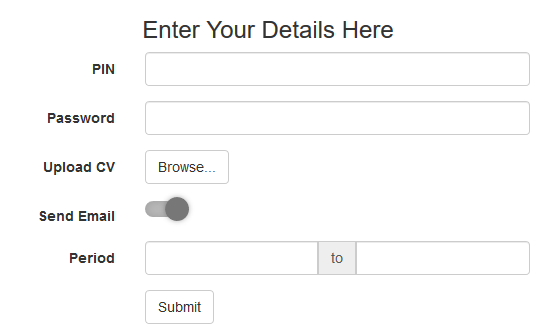

    <h1>Formy<h1>

A simple approach to creating HTML forms with BOOTSTRAP

<pre>
var fm = [
     { label: "&lt;h3&gt;Enter Your Details Here&lt;/h3&gt;", 
	   name: "pin" , type:"titlebox", attrs:{"class":"text-center"}
	},
     { label: "PIN", name: "pin" },
     { label: "Password", name: "pwd", type:"password"},
     { label: "Upload CV", name: "upload", type:"file"},
     { label: "Period", name: "start,end", type:"daterange"},
     { label: "Submit", name: "submit", type:"button"}
];
$("#formarea").formy("createForm", fm);
</pre>
